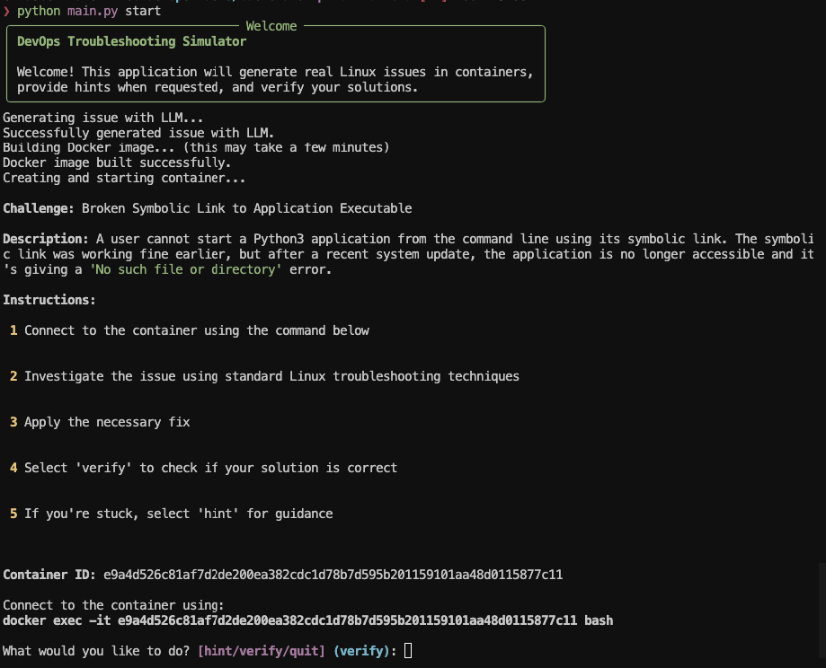

# CB DevOps Challenges

An interactive application that generates real-world DevOps challenges in containers, provides hints, and verifies solutions. Currently focused on Linux troubleshooting, with more skills to be added in the future.

I built this project to keep reviewing and updating my DevOps skills, creating a hands-on learning environment for continuous improvement. I believe that strong Linux skills are the most important foundation for any DevOps professional, which is why this project initially focuses on Linux-based challenges.

## Application Preview

Below is a screenshot showing the application in action:



## Features

- Generates realistic DevOps challenges using LLM integration
- Runs challenges in isolated Docker containers
- Provides hints when requested
- Verifies if the user's solution correctly resolves the challenge
- Tracks user progress and learning

## Requirements

- Python 3.9+
- Docker
- OpenAI API key (or other LLM provider)

## Installation

1. Clone this repository:
   ```
   git clone <repository-url>
   cd cb-devops-challenges/backend
   ```

2. Install the dependencies:
   ```
   python -m venv venv
   source venv/bin/activate  # On Windows: venv\Scripts\activate
   pip install -r requirements.txt
   ```

3. Set up your environment variable and add your OpenAI API key:
   ```
   export OPENAI_API_KEY=your_api_key_here
   ```

## Current Limitations & Future Plans

- **LLM Support**: Currently only supports OpenAI's API. Support for additional LLM providers is on the roadmap.
- **Container Runtime**: Planning to migrate to Sysbox runtime for Docker, which will enable more realistic challenges by abstracting the container layer and supporting systemd, allowing for more complex system-level scenarios.
- **User Interface**: A frontend layer is planned to improve user experience and provide a more convenient interface for interacting with challenges.

## Step-by-Step User Guide

### Starting the Application

1. Ensure Docker is running on your system before starting the application.

2. Start the application:
   ```
   python main.py
   ```
   
   You can specify a difficulty level:
   ```
   python main.py start --difficulty easy
   ```
   Options are: easy, medium (default), hard

3. The application will check requirements and generate a challenge.

4. You'll see:
   - Challenge title
   - Description of the issue
   - Container ID
   - Command to connect to the container

### Solving a Challenge

1. **Connect to the Container**:
   Open a new terminal window and run the provided command:
   ```
   docker exec -it <container-id> bash
   ```

2. **Investigate the Issue**:
   Use appropriate commands to diagnose and troubleshoot the problem.
   
3. **Request Hints** (if needed):
   - In the main application window (not the container terminal), you'll see a prompt asking "What would you like to do?"
   - Type `hint` and press Enter
   - The application will display a hint to help you solve the issue
   - Each time you request a hint, you'll receive progressively more specific guidance

4. **Apply a Solution**:
   Based on your investigation and any hints, implement a solution in the container.

5. **Verify Your Solution**:
   - In the main application window, when prompted for an action, type `verify`
   - The application will check if your solution resolves the issue
   - You'll receive feedback on whether your solution was successful

6. **Next Steps**:
   - If successful: You can choose to try another challenge or exit
   - If unsuccessful: Continue troubleshooting and try again

7. **Exit the Application**:
   Type `quit` when prompted for an action to clean up containers and exit.

### Example Walkthrough: Linux DNS Resolution Issue

1. Start the application and connect to the container.

2. Inside the container, try to ping a domain:
   ```
   ping google.com
   ```
   You'll see an error about unknown host.

3. Check if you can ping an IP address:
   ```
   ping 8.8.8.8
   ```
   This should work, indicating a DNS issue.

4. Examine the DNS configuration:
   ```
   cat /etc/resolv.conf
   ```
   You'll see it's empty or has only comments.

5. Add proper DNS nameservers to the file:
   ```
   echo "nameserver 8.8.8.8" > /etc/resolv.conf
   echo "nameserver 8.8.4.4" >> /etc/resolv.conf
   ```

6. Test DNS resolution again:
   ```
   ping google.com
   ```
